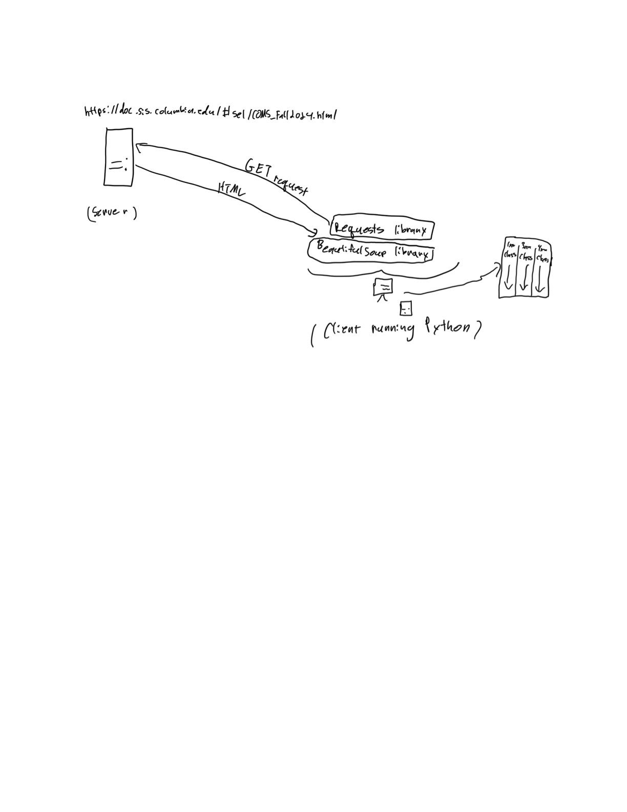

# COMS W3132 Individual Project

## Author
Tony Giannini aug2102@columbia.edu
Sam Edwards se2584@columbia.edu

## Project Title
Computer Science Class Tracker

## Project Description
We want to write a program that lists next semester's computer science class
offerings. The current directory that has this information is difficult to
navigate and is not specific to computer science courses. The organization is
also sloppy. We want to display the data in a way that is more aesthetically
pleasing. We also want to make the data easier to access.

One big issue with the current directory is that it doesn't list pre-requisite
courses. We plan to list these with the offerings. We will either hard-code or
scrape them.

This project will give us a great opportunity to practice web scraping with
Python. It will be fun to organize the data in a way that looks good. Our
program could be shared with others who are also fed up with the current
directory. During the rest of the semester we want to figure out how to scrape
a webpage with Python. We want to learn out how filter the data and format it
appropriately. We plan on using Dash to display the data. 

*Write a short, concise project description of what your project aims to achieve. Include the motivation for this project (why do you want to work on it), the problem your project aims to solve, and the main goals that you want to accomplish within the rest of the semester. Also mention why you think the project might be useful or interesting to others. Keep this section short. A couple of paragraphs would do.*

## Timeline

For milestone 2 we plan to deliver a sample output file showing data scraped
from the directory in a rather rough form. We also plan to turn in an
incomplete version of our main program which achieves the goal of actually
retrieving data from the directory and filtering out what we do not want. 

*To track progress on the project, we will use the following intermediate milestones for your overall project. Each milestone will be marked with a tag in the git repository, and we will check progress and provide feedback at key milestones.*

| Date               | Milestone                                                                                              | Deliverables                | Git tag    |
|--------------------|--------------------------------------------------------------------------------------------------------|-----------------------------|------------|
| **March&nbsp;29**  | Submit project description                                                                             | README.md                   | proposal   |
| **April&nbsp;5**   | Update project scope/direction based on instructor/TA feedback                                         | README.md                   | approved   |
| **April&nbsp;12**  | Basic project structure with empty functions/classes (incomplete implementation), architecture diagram | Source code, comments, docs | milestone1 |
| **April&nbsp;19**  | Progress on implementation (define your own goals)                                                     | Source code, unit tests     | milestone2 |
| **April&nbsp;26**  | Completely (or partially) finished implementation                                                      | Source code, documentation  | milestone3 |
| **May&nbsp;10**    | Final touches (conclusion, documentation, testing, etc.)                                               | Conclusion (README.md)      | conclusion |

*The column Deliverables lists deliverable suggestions, but you can choose your own, depending on the type of your project.*

## Requirements, Features and User Stories

- Each run of the program will create a new output file that contains data
retrieved from the course directory. This will allow the user to run the
program each time he/she wants to see the most up-to-date course information.

- The classes will be divided into columns based on their difficulty level by
default. The current webpage forces the user to scroll through CS courses they
might not be interested in becuase they have a low difficulty level. This
format will make it so that the user sees what they want to see right away. 

- Users of the current directory might often be disapointed to find out that
prerequisites are not listed. Our output will have prerequisites.

- We plan on having a dropdown menu where different course organizations can be
selected. If the user does not want thier courses arranged by difficulty level
or wants to filter out certain course groups, they will be able to do that.

***We will need our computers, Python, and an internet connection for this
project. 

*List the key requirements or features of your project. For each feature, provide a user story or a simple scenario explaining how the feature will be used. You don't have to get this section right the first time. Your understanding of the problem and requirements will improve as you work on your project. It is okay (and desirable) to come back to this section and revise it as you learn more about the problem you are trying to solve. The first version of this section should reflect your understanding of your problem at the beginning of the project.*

*Also list any required hardware, software, on online services you will need. In specific cases, we might be able to lend you hardware or obtain online services. Please email the instructor for more details.*

## Technical Specification

We are going to use the Requests and BeautifulSoup libraries. The Requests
library is for scraping data from webpages. BeautifulSoup can be used to parse
raw HTML data. The Requests library will be used to extract HTML data from the
course directory. BeautifulSoup will be used to parse this data. BeautifulSoup
will allow us to isolate the data we are interested in. We are going to use
Dash, a data-visualization framework, to assist us in displaying the data in a
clean way. pandas will be used to store the data in a table on the front-end. 
This table will be given to Dash to display.

We plan on storing course information in a linked-list. Each node will
represent a course. This is how course information will be stored on the
back-end. On the front-end, the data will need to be converted to a python
list. This is because a pandas dataframe takes a list when being created. We
want to use the linked list on the back-end becuase we feel it has been an
integral component of this course and want to demonstrate its use. It's a
little extra work, but we feel that it's worth it.

*Detail the main algorithms, libraries, and technologies you plan to use. Explain your choice of technology and how it supports your project goals.*

## System or Software Architecture Diagram

*Include a block-based diagram illustrating the architecture of your software or system. This should include major components, such as user interface elements, back-end services, and data storage, and show how they interact. Tools like Lucidchart, Draw.io, or even hand-drawn diagrams photographed and uploaded are acceptable. The purpose of the diagram is to help us understand the architecture of your solution. Diagram asthetics do not matter and will not be graded.*

## Development Methodology

Since there are a couple people working on this project, branching and pull
requests will be used so that one person can review the other's work before
merging it with the main branch. This will make it easier to spot bugs and
offer sugestions.

We are also going to make use of the milestones. We are not going to treat them
as hard deadlines, but we will aim to do what they suggest within a few days of
their dates.

This program can be tested manually, we are just going to make sure the output
of the script actually produces all the data listed on the relevant section of
the directory. There are no specific frameworks or libraries we plan to use.

Sam will focus more on data visualization and Tony will focus more on web
scraping. We plan to do most of the project together in the same room. Working
through solutions together will be fun and efficient.

*Describe the methodology you'll use to organize and progress your work.*

*First, describe your plan for developing your project. This might include how (or if) you plan to use*
- *GitHub projects board to track progress on tasks and milestones*
- *GitHub issues to keep track of issues or problems*
- *Separate Git branches and/or GitHub pull requests for development*
- *GitHub actions for automated testing or deployment pipelines*
- *GitHub wiki for documentation and notes*

*Please also describe how (if) you plan test and evaluate your project's functionality. Do you plan to test manually or automatically? Any specific testing frameworks or libraries you plan to use?*

## Potential Challenges and Roadblocks

We are going to have to learn how to use the Requests and BeautifulSoup
libraries. This challenge can be overcome by reading the documentation of the
libraries.

We are also going to have to learn some HTML basics to understand how to get
the data we want from the directory. We will overcome this challenge by using
online tutorials to learn the basics of HTML.

Time managment will be a challenge due to our very heavy workloads this
semester. To mitigate this, we will pay extra attention to the milestones so
that we do not fall behind. Preventing the work from building up will make this
project managable. 

*Identify any potential challenges or roadblocks you anticipate facing during the development of your project. For each challenge, propose strategies or solutions you might use to overcome them, which may include getting help from the TAs/instructor. This could include technical hurdles or learning new technologies.*

## Additional Resources

- For learning HTML: https://www.htmldog.com
- For learning BeautifulSoup:
https://www.crummy.com/software/BeautifulSoup/bs4/doc/
- For learning Requests: https://realpython.com/python-requests/
- For learning web scraping:
https://realpython.com/python-web-scraping-practical-introduction/

*Include any additional resources, tutorials, or documentation that will be helpful for this project.*

## Conclusion and Future Work

We are looking forward to developing this program. It is going to be nice not
to have to sift through the course directory anymore for computer science
classes.

In the future, we could make a website with a single page that displays the
output of this program when clicked on. This would make it so that no one has
to download any python files to use it.

Another future development might be to generalize the program to have the
capacity to fetch course listings from any department. However, as of now, the
focus is on the computer science department.

*Wrap up your project description with any final thoughts, expectations, or goals not covered in the sections above. Also briefly discuss potential future work, i.e., what could be done next to improve the project.*
